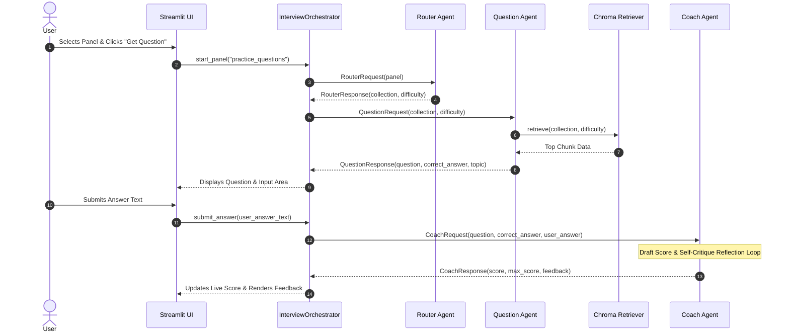

# 🎓 Interview Preparation Coach

An Agentic AI Streamlit Application built for university module **IT41043 (Agentic AI)**.

---

## 📌 Project Description

**Interview Preparation Coach** is an agentic AI system designed to solve the real-world problem of fragmented and unguided interview preparation for university students and job seekers. Traditional interview prep relies on static Q&A lists without personalized evaluation, real-time feedback, or structural interview guidance. 

This application provides a multi-panel, interactive coaching experience across three core domains:
1. **🎯 Practice Questions Panel (`practice_questions`)**: Offers interactive technical and behavioral questions, evaluates student answers using a two-step AI reflection loop, awards scores out of 10, and updates session metrics live.
2. **💡 How to Face an Interview (`how_to_face_interview`)**: Delivers structured interview technique guidance, including the STAR methodology, body language tips, and strategies for avoiding common candidate mistakes.
3. **🤝 Connect with Industry Experts (`connect_with_experts`)**: Provides actionable LinkedIn networking strategies and ready-to-use professional outreach message templates.

---

## 🏗️ System Architecture

```text
                               +----------------------------------+
                               |     Streamlit UI (app.py)        |
                               +----------------------------------+
                                                |
                                                v
                               +----------------------------------+
                               |   InterviewOrchestrator Agent    |
                               |    (agents/orchestrator.py)      |
                               +----------------------------------+
                                 /              |               \
                                /               |                \
                               v                v                 v
                 +-------------------+ +------------------+ +------------------+
                 |   Router Agent    | | Question Agent   | |   Coach Agent    |
                 | (router_agent.py) | |(question_agent.py| | (coach_agent.py) |
                 +-------------------+ +------------------+ +------------------+
                           |                    |                     |
                           v                    v                     v
                    +------------+     +------------------+    +--------------+
                    |  Groq SDK  |     |  Chroma DB (RAG) |    |  OpenRouter  |
                    | (Llama 3.1)|     |  & ReAct Step    |    | (GPT-4o-mini)|
                    +------------+     +------------------+    +--------------+
```

---

## ⚡ Setup & Local Execution Instructions

### Prerequisites
- Python 3.10+
- Git

### Step 1: Clone Repository & Create Virtual Environment
```bash
git clone https://github.com/Janadari1213/Interview-Preparation-Coach.git
cd Interview-Preparation-Coach/interview-prep-coach
python -m venv venv
```

Activate the virtual environment:
- **Windows (PowerShell):** `.\venv\Scripts\Activate.ps1`
- **Linux/macOS:** `source venv/bin/activate`

### Step 2: Install Dependencies
```bash
pip install -r requirements.txt
```

### Step 3: Configure API Keys
Create a `.env` file in the project root:
```env
GROQ_API_KEY=your_groq_api_key_here
OPENROUTER_API_KEY=your_openrouter_api_key_here
```

*(Note: For local testing with Streamlit, `.streamlit/secrets.toml` can also be configured with the same key names).*

### Step 4: Run Knowledge Base Ingestion Pipeline
Build the Chroma vector database collections:
```bash
python kb/ingest.py
```

### Step 5: Launch Streamlit Application
```bash
streamlit run app.py
```

---

## 🤖 Model Choice & LLM Trade-off Comparison

| Model | Provider | Assignment Role | Latency | Cost | Reasoning / Quality Justification |
| :--- | :--- | :--- | :--- | :--- | :--- |
| **Llama 3.1 8B Instant** | Groq | Router Agent & ReAct Decision Step | Extremely Low (~200ms) | Free / Minimal | Fast classification and decision-making where speed is critical to UI responsiveness. |
| **GPT-4o-mini** | OpenRouter | Question Rephrasing & Coach Reflection | Low (~800ms) | Low Cost | High reasoning capability for multi-step answer evaluation, nuanced scoring, and self-critique. |

---

## 💬 Agent-to-Agent Communication Protocol

Agents exchange strongly typed dataclasses defined in [`protocol/messages.py`](file:///c:/Users/jandari/Music/Interview-Preparation-Coach/interview-prep-coach/protocol/messages.py). Each message includes a `.to_dict()` method for logging and JSON-style message formatting.

### Sequence Diagram



---

## 📚 RAG Pipeline & Retrieval Evaluation

The Retrieval-Augmented Generation (RAG) system reads markdown documents across 3 dedicated subfolders in `kb/documents/` and persists them to 3 Chroma DB collections in `kb/chroma_db/`:
- **`technical_qa`**: 13 Q&A pairs covering OOP, Networking, DBMS, and Operating Systems.
- **`interview_tips`**: 8 section chunks covering STAR method, common mistakes, and body language.
- **`networking_advice`**: 5 section chunks covering LinkedIn outreach and message templates.

### Chunking & Embedding Strategy
- **Chunking**: Markdown files are split strictly on `## ` section headings so that individual Q&A pairs or advice sections form complete, un-fragmented semantic units.
- **Embeddings**: Chunks are embedded using `sentence-transformers/all-MiniLM-L6-v2`.

### Retrieval Benchmark Evaluation Results (`tests/test_retrieval.py`)

| # | Query | Target Collection | Similarity Score | Retrieved Source File | Relevance Evaluation |
| :-: | :--- | :--- | :-: | :--- | :--- |
| **1** | *"What is polymorphism?"* | `technical_qa` | **0.7615** | `oop_questions.md` | **Exact match**: Retrieved polymorphism definition and implementation details. |
| **2** | *"How does TCP differ from UDP?"* | `technical_qa` | **0.8337** | `networking_questions.md` | **Exact match**: Retrieved TCP connection-oriented vs UDP comparison chunk. |
| **3** | *"How should I structure a behavioral answer?"* | `interview_tips` | **0.4044** | `star_method.md` | **High relevance**: Retrieved STAR methodology framework breakdown. |
| **4** | *"What's a common mistake candidates make?"* | `interview_tips` | **0.7104** | `common_mistakes.md` | **Exact match**: Retrieved candidate mistakes listing. |
| **5** | *"How do I message someone on LinkedIn for networking?"* | `networking_advice` | **0.6198** | `linkedin_outreach.md` | **Exact match**: Retrieved LinkedIn networking and cold outreach strategy. |

---

## 🧩 Agentic Design Patterns Implemented

1. **Orchestrator-Worker Pattern** ([`agents/orchestrator.py`](file:///c:/Users/jandari/Music/Interview-Preparation-Coach/interview-prep-coach/agents/orchestrator.py)): Central `InterviewOrchestrator` manages session state and delegates domain tasks to dedicated worker agents without calling LLMs directly.
2. **Router Pattern** ([`agents/router_agent.py`](file:///c:/Users/jandari/Music/Interview-Preparation-Coach/interview-prep-coach/agents/router_agent.py)): Dynamically determines target knowledge collection and difficulty rating (`easy`, `medium`, `hard`) using Groq Llama 3.1 8B.
3. **ReAct (Reason + Act) Pattern** ([`agents/question_agent.py`](file:///c:/Users/jandari/Music/Interview-Preparation-Coach/interview-prep-coach/agents/question_agent.py)): Evaluates retrieved KB chunks to decide if content is clear as-is (`AS_IS`) or requires light rephrasing (`REWRITE`) before presenting to the user.
4. **Reflection / Self-Critique Pattern** ([`agents/coach_agent.py`](file:///c:/Users/jandari/Music/Interview-Preparation-Coach/interview-prep-coach/agents/coach_agent.py)): Employs a 2-step evaluation loop (Draft Evaluation followed by Self-Critique Reflection) to verify fair scoring and prevent penalizing valid alternate candidate phrasing.

---

## 🌐 Live Streamlit Demo

**Live App URL:** [TO BE ADDED AFTER DEPLOYMENT]

---

## ⚠️ Known Limitations

- **Corpus Size**: The Knowledge Base contains a focused dataset of 26 total chunks across technical, behavioral, and networking topics.
- **Single-Session Storage**: Session scores and history are stored in Streamlit `st.session_state` and reset when refreshing the browser or clicking "Reset Session".
- **Rate Limits**: Dependent on free-tier API quotas for Groq and OpenRouter; built-in error shielding prevents UI crashes if limits are reached.
