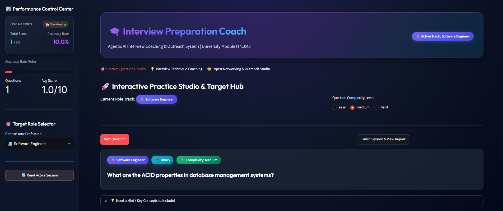

# 🎓 Interview Preparation Coach

[](https://interview-preparation-coach0.streamlit.app/)

[](https://www.python.org/)
[](https://streamlit.io/)
[](https://groq.com/)
[](https://openrouter.ai/)
[](https://www.trychroma.com/)
[](LICENSE)
[]()

> 🚀 **Live Production Web Application**: [https://interview-preparation-coach0.streamlit.app/](https://interview-preparation-coach0.streamlit.app/)  
> **An Agentic AI Multi-Agent Preparation, Strategy Coaching & Industry Outreach Platform.**  
> *Developed for Academic Module IT41043 — Final Project Phase (Submission Date: 27th July 2026).*

---

## 📌 Executive Summary

**Interview Preparation Coach** is a full-stack agentic platform designed to assist job candidates in mastering technical interviews, behavioral questions, and professional industry networking. Driven by an autonomous multi-agent architecture, the system combines **Retrieval-Augmented Generation (RAG)** over role-specific vector databases with **dual-stage LLM evaluation and reflection**.

The platform provides tailored coaching across four professional domains: **Software Engineering**, **Data Analysis**, **Product Management**, and **UX Design**.

---

## 🖥️ System Interface

[](https://interview-preparation-coach0.streamlit.app/)

---

## 🤖 Agent Architecture & Workload Breakdown

The platform operates using four decoupled, specialized agents communicating via typed messaging protocols (`protocol/messages.py`).

```
                              ┌────────────────────────┐
                              │   Streamlit Web UI     │
                              └───────────┬────────────┘
                                          │
                                          ▼
                              ┌────────────────────────┐
                              │ InterviewOrchestrator  │
                              └───────────┬────────────┘
                                          │
                ┌─────────────────────────┼─────────────────────────┐
                │                         │                         │
                ▼                         ▼                         ▼
       ┌──────────────────┐      ┌──────────────────┐      ┌──────────────────┐
       │   RouterAgent    │      │  QuestionAgent   │      │    CoachAgent    │
       │ (Intent Routing) │      │ (ReAct Content)  │      │(2-Stage Evaluation│
       └────────┬─────────┘      └────────┬─────────┘      └────────┬─────────┘
                │                         │                         │
                └─────────────────────────┼─────────────────────────┘
                                          │
                                          ▼
                              ┌────────────────────────┐
                              │ ChromaDB Vector Engine │
                              └────────────────────────┘
```

### Agent Workload Matrix

| Agent Name | System Role | Primary Workload & Responsibilities | Models & Dependencies | Input / Output Schema |
| :--- | :--- | :--- | :--- | :--- |
| **`InterviewOrchestrator`** | **Session Coordinator** | • Manages session state & history log<br>• Coordinates sub-agent execution flow<br>• Calculates running scores & accuracy %<br>• Generates downloadable Markdown reports | Python Dataclasses, Streamlit Session State | `RouterRequest` ➔ `QuestionResponse`<br>`CoachRequest` ➔ `CoachResponse` |
| **`RouterAgent`** | **Intent Classifier** | • Classifies user panel intent<br>• Maps panel requests to target Chroma collections (`technical_qa`, `interview_tips`, `networking_advice`) | Rule-based Routing Engine | `RouterRequest` ➔ `RouterResponse` |
| **`QuestionAgent`** | **Content & ReAct Agent** | • Queries ChromaDB vector database<br>• Fast-path clean question retrieval<br>• ReAct evaluate-and-rewrite workflow<br>• Eliminates raw metadata leaks from prompts | ChromaDB, SentenceTransformers (`all-MiniLM-L6-v2`), Groq, OpenRouter | `QuestionRequest` ➔ `QuestionResponse` |
| **`CoachAgent`** | **Dual-Stage Evaluation Agent** | • **Stage 1 (Draft)**: Concept comparison vs answer key<br>• **Stage 2 (Reflection)**: Senior reviewer self-critique<br>• Assigns 0–10 score & detailed feedback<br>• Automatic failover (OpenRouter ➔ Groq) | OpenRouter (`gpt-4o-mini`), Groq (`llama-3.1-8b-instant`) | `CoachRequest` ➔ `CoachResponse` |

---

## 🎯 Studio Capabilities & Features

| Studio Panel | Core Capability | Workload & Operations | Interactive UI Features |
| :--- | :--- | :--- | :--- |
| **🎯 Practice Studio** | Technical Q&A Practice | Retrieves role-specific technical questions filtered by complexity (`Easy`, `Medium`, `Hard`). | • Hint Expander<br>• Live Word Counter<br>• Auto Model Answer Box (`Score < 8`) |
| **📝 Performance Report** | Session Analytics | Evaluates candidate answers, calculates running score/accuracy, and compiles session summary. | • Score Bar Chart (`st.bar_chart`) <br>• Color-Coded Cards (🟢/🟡/🔴)<br>• Downloadable `.md` Report |
| **💡 Technique Studio** | Behavioral Coaching | Guides candidates through behavioral interviewing and body language strategy. | • 4-Step STAR Method Builder<br>• RAG Pitfall vs. Solution Cards |
| **🤝 Outreach Studio** | Industry Networking | Outlines referral strategies, cold outreach hooks, and 15-minute coffee chat structure. | • 3-Step Networking Playbook<br>• Customizable Template Generator<br>• RAG Strategic Advice Cards |

---

## 📚 Professional Role Tracks & Knowledge Base Datasets

| Professional Track | Knowledge Base Coverage | Datasets Source | Default Complexity |
| :--- | :--- | :--- | :--- |
| 💻 **Software Engineer** | Object-Oriented Programming (OOP), Operating Systems, DBMS, System Architecture, Networking | `oop.md`, `networking.md`, `dbms.md`, `os.md` | Medium / Hard |
| 📊 **Data Analyst** | SQL Window Functions, A/B Testing, ETL Data Pipelines, Data Cleaning, Pandas DataFrames | `data_analyst_questions.md` | Easy / Medium |
| 📦 **Product Manager** | RICE Prioritization Framework, Product Metrics (DAU/MAU), User Discovery, Product Strategy | `product_manager_questions.md` | Medium / Hard |
| 🎨 **UX Designer** | Nielsen Usability Heuristics, Information Architecture, Card Sorting, Accessibility (WCAG), Wireframing | `ux_designer_questions.md` | Easy / Medium |

---

## 📁 Repository Directory Structure

```
interview-prep-coach/
├── agents/
│   ├── coach_agent.py          # Dual-stage evaluation agent with model failover
│   ├── orchestrator.py         # Multi-agent session orchestrator
│   ├── question_agent.py       # ReAct retrieval & content agent
│   └── router_agent.py         # Intent classification & collection router
├── assets/
│   └── home_ui.png             # UI Screenshot asset
├── kb/
│   ├── chroma_db/              # Pre-built vector database embeddings
│   ├── documents/              # Markdown knowledge base source files
│   │   ├── technical_qa/       # Q&A datasets (SE, Data Analyst, PM, UX)
│   │   ├── interview_tips/     # Behavioral interviewing & STAR method
│   │   └── networking_advice/  # Prospecting, informational chats & referrals
│   ├── ingest.py               # Vector ingestion script
│   └── retriever.py            # ChromaDB similarity retriever & cache manager
├── models/
│   ├── groq_client.py          # Groq Llama-3.1 API client
│   └── openrouter_client.py    # OpenRouter GPT-4o-mini API client
├── protocol/
│   └── messages.py             # Typed dataclasses for inter-agent messaging
├── tests/
│   ├── test_agents.py          # Agent orchestration unit tests
│   └── test_retrieval.py       # ChromaDB vector retrieval tests
├── .env                        # Environment variable API keys
├── .gitignore                  # Git ignore rules
├── app.py                      # Main Streamlit web application
├── README.md                   # Formal project documentation
└── requirements.txt            # Python dependencies
```

---

## ⚡ Quick Start & Setup Guide

### 1. Environment Setup
```bash
# Clone repository
git clone https://github.com/Janadari1213/Interview-Preparation-Coach.git
cd Interview-Preparation-Coach/interview-prep-coach

# Create and activate virtual environment
python -m venv venv
.\venv\Scripts\Activate.ps1  # Windows PowerShell
# source venv/bin/activate   # macOS / Linux
```

### 2. Install Dependencies
```bash
pip install -r requirements.txt
```

### 3. API Key Configuration
Create a `.env` file in the project root (`interview-prep-coach/.env`) or configure `.streamlit/secrets.toml`:

```env
GROQ_API_KEY=gsk_your_groq_api_key_here
OPENROUTER_API_KEY=sk-or-v1-your_openrouter_api_key_here
```

### 4. Vector Database Ingestion (Optional)
The pre-built vector database is included in the repository. To re-ingest custom markdown documents:

```bash
python kb/ingest.py
```

### 5. Launch Web Application
```bash
python -m streamlit run app.py
```
Open **`http://localhost:8501`** in your browser.

---

## 🧪 Testing & Verification

Run the automated pytest test suite to verify agent orchestration and vector search:

```bash
# Run agent orchestration tests
python tests/test_agents.py

# Run vector retrieval tests
python tests/test_retrieval.py
```

---

## 📜 Academic Metadata & License

| Field | Detail |
| :--- | :--- |
| **Live Web App** | [interview-preparation-coach0.streamlit.app](https://interview-preparation-coach0.streamlit.app/) |
| **Academic Module** | IT41043 — Advanced Agentic AI Applications |
| **Project Phase** | Phase 5 (Final Phase — Deployment & Delivery) |
| **Submission Date** | 27th July 2026 |
| **License** | [MIT License](LICENSE) |
